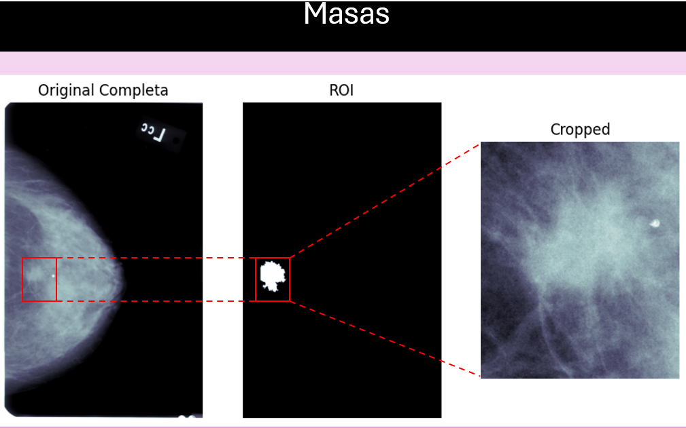
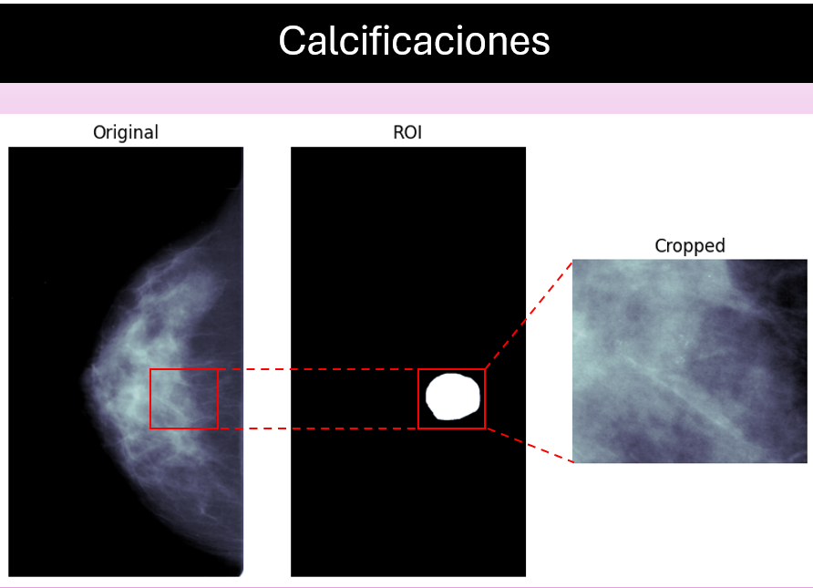
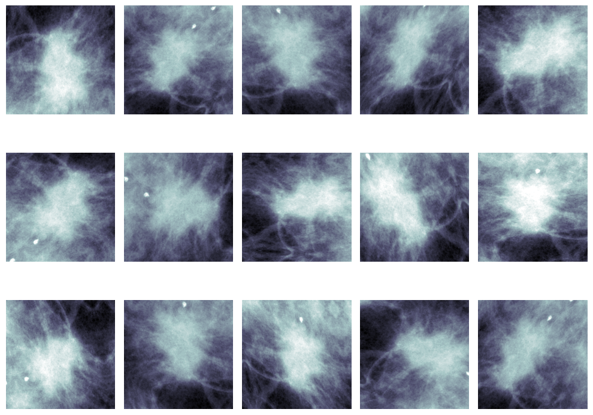
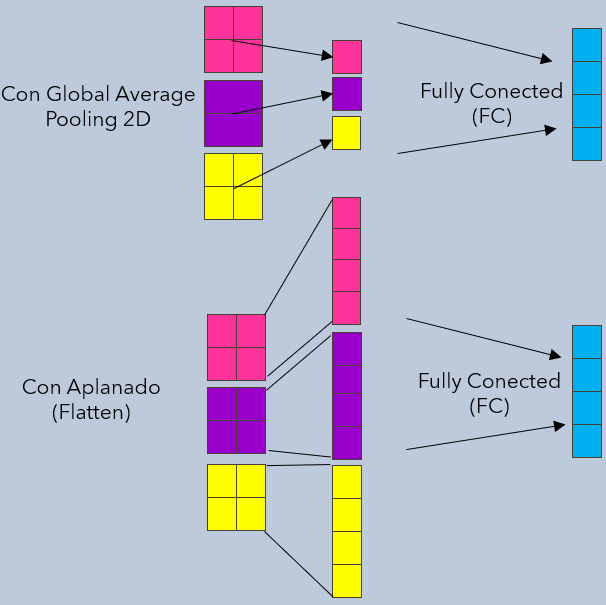
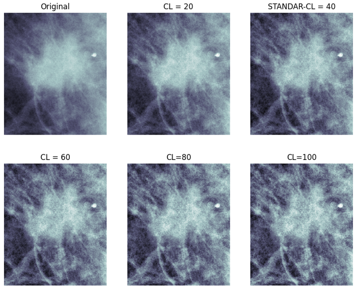
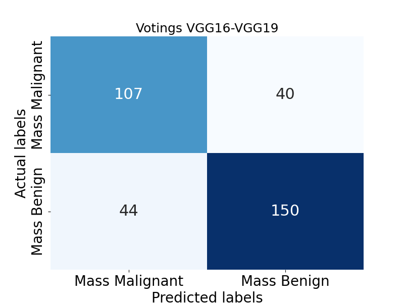

# Definition and Execution of Experiments in the Master's Thesis

     

All experiments were carried out using the [**CBIS-DDSM** database](https://github.com/LuisGuillermoRL/EDA_CBIS-DDSM/blob/main/docs/sdata2017177.pdf). The database contains two types of abnormalities found in mammograms: **Masses** and **Calcifications**. These are further categorized by their pathologies: **Benign** and **Malignant**. It's important to clarify that while the database provides full mammograms, masks or ROIs from which patches (cropped images) are extracted, and the patches themselves, this work exclusively focused on these patches. These were resized to 224×224 pixels. This decision was based on the fact that these patches contain the most relevant information, meaning a complete mammogram isn't necessary to address the problem. Through the exploration, labeling, and image acquisition process of this database ([EDA](https://github.com/LuisGuillermoRL/EDA_CBIS-DDSM/tree/main)), the experiments described below were made possible.

In this repository, you'll find examples and results from the experiments carried out for this thesis. These are defined and illustrated below:

* Example [**Masses Experiment**](./Mass_InV3.ipynb). As the name suggests, this is a binary classification experiment: one class is **Benign Mass** and the other is **Malignant Mass**. This experiment helps detect cancer by using only images corresponding to Masses. Once a CNN is trained, you can input a patch (containing a mass) of the same size it was trained on ($224 \times 224$) to obtain its class (benign or malignant).

* Example [**Calcifications Experiment**](./Calc_CLAHE_DenseNet121.ipynb). Similar to the previous experiment, this is also a binary classification experiment: one class is **Benign Calcification** and the other is **Malignant Calcification**. This experiment also aids in cancer detection by utilizing only images corresponding to Calcifications. Once a CNN is trained, it should be presented with a patch (containing calcifications) of the size it was trained on ($224 \times 224$).

* Example [**Multiclass Experiment**](./4C_ResNet50.ipynb). As you can see, there are currently four classes: **Benign Mass, Malignant Mass, Benign Calcification**, and **Malignant Calcification**. In this cancer detection experiment, all four classes (all images) were used to train various CNNs. Here, these models can be presented with a patch containing either a mass or calcifications to obtain the corresponding class.

* Example [**Malignant-Benign (M-B) Experiment**](./M-B_CLAHE_VGG19.ipynb). To use all images for cancer detection in a different way than the Multiclass Experiment, two classes were defined here: **Malignant** and **Benign**, regardless of whether they are masses or calcifications (their abnormality). In other words, Malignant Masses and Malignant Calcifications were combined to represent the Malignant class, and Benign Masses and Benign Calcifications were combined to represent the Benign class.

* Example [**Masses-Calcifications (M-C) Experiment**](./M-C_ResNet50.ipynb). This is a binary classification experiment: one class is **Mass** and the other is **Calcification**. All images were used in this experiment, but it doesn't help detect cancer as it only distinguishes between Masses and Calcifications. This experiment was conducted to evaluate the performance of different CNNs and to compare results with those obtained by [**Lai (2021)**](https://github.com/leoll2/MedicalCNN/tree/master), as this author also performed it.

Here's a quick overview of additional experimental details:

* We experimented with each of the CNNs, varying the number of neurons.

* Because we don't have many images, we used **TensorFlow's Image Data Generator (IDG)**. This helps prevent overfitting and slightly increases the classification rate. To do this, we simultaneously explored different parameters for the IDG, referred to in the thesis as *Proposed Parameters* and *Initial Parameters* (which [**Lai (2021)**](https://github.com/leoll2/MedicalCNN/tree/master) used). Below is an illustration of operations performed on a patch using the *Proposed Parameters* specified in **TensorFlow's IDG**.

* We also experimented with replacing the *Flatten layer* in the CNNs with the *Global Average Pooling 2D (GAvgP2D)* layer, which acts as a dimensionality reduction technique. The idea of how it works is illustrated below.

* The **CLAHE technique** was also applied to the images to try and increase the classification rate. For this, we used the **OpenCV library** with the *cv2.createCLAHE()* method, using standard parameters. Below are different results when applying CLAHE (with varying parameters) to a patch corresponding to a mass.
  

* Finally, we used the *Soft Voting Ensemble technique* ([Example of soft voting with confusion matrix plots](https://github.com/LuisGuillermoRL/Distintos_Experimentos/blob/main/votings_results_Mass.ipynb)) in all experiments with the best-performing models. This was done to achieve the highest accuracy by combining the predictions of the CNNs. Since CNN predictions are probabilities, they can be averaged to try and boost the classification rate, however, this doesn't always significantly improve the rate because while successes are averaged, so are errors. Below is the confusion matrix showing the best combination of CNNs that yielded the highest classification rate in the **Masses Experiment**.

## Results

As you can see, we performed many combinations of experiments. In summary, no single experiment dramatically outperformed the others. However, experiments using the GAvgP2D layer almost consistently yielded slightly lower accuracy, while the remaining experiments showed more consistent results.

Here's an experimental summary featuring the best CNN for each experiment:

| **Experiment** | **CNN Accuracy ** | **[Jaamour et al. (2023)](./docs/BCD_using_DL_Techniques.pdf)** | **[Lai (2021)](https://github.com/leoll2/MedicalCNN/tree/master)**|
| :--- | :--- | :--- | :--- |
| **Masses** | **Varias: 74.48%** | VGG19: 64.35% | No realizado |
| **Calcifications** | **DenseNet121: 67.56%** | VGG19: 67.05% | No realizado |
| **Multiclass** | ResNet50: 62.5% | No realizado | No realizado |
| **Malignant-Benign (M-B)** | **VGG19: 70%** | MobileNetV2:67.08% | VGG16: 69% |
| **Masses-Calcifications (M-C)** | **ResNet50: 92.5%** | No relizado | VGG16: 91.66% |

Experimental Summary: Best CNN Combination in *Soft Voting*:

| **Experimento** | **Accuracys from the Table Above** | **Accuracys (Soft Voting)**
| :--- | :--- | :--- |
| **Masses** | VGG19 e InceptionV3: 74.48% | **VGG16-VGG19: 75.36%** |
| **Calcifications** | DenseNet121: 67.56% | **VGG16-ReNet50-MobileNetV2: 69.4%** |
| **Multiclass** | ResNet50: 62.5% | **VGG16-InceptionV3-ResNet50: 66.16%** |
| **Malignant-Benign (M-B)** | VGG19: 70% | **VGG16-DenseNet121-MobileNetV2: 72.5%** |
| **Masses-Calcifications (M-C)** | ResNet50: 92.5% | **VGG16-DenseNet121: 94.83%** |
| **Masses-Calcifications (M-C) (Anexos de la Tesis)** | ResNet50: 94.5% | **ResNet50-DenseNet121: 95.33%** |

To conclude, it's worth noting that in the other two experimental blocks, we approached the experiments differently with more organized code, incorporating machine learning and additional ensemble methods.

**Note**. These experiments were conducted in a **Python virtual environment (venv)** on *Windows* using **TensorFlow version 11** and an **NVIDIA RTX 4080 GPU**.
